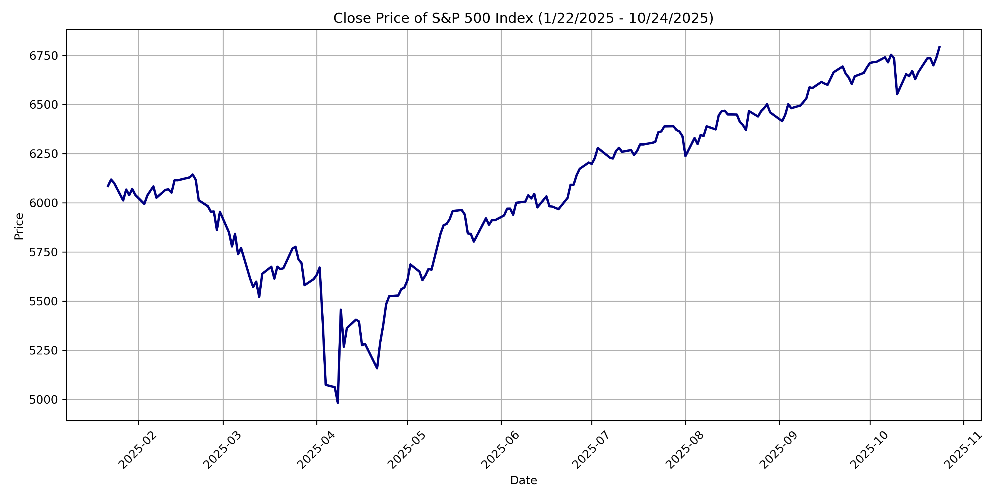
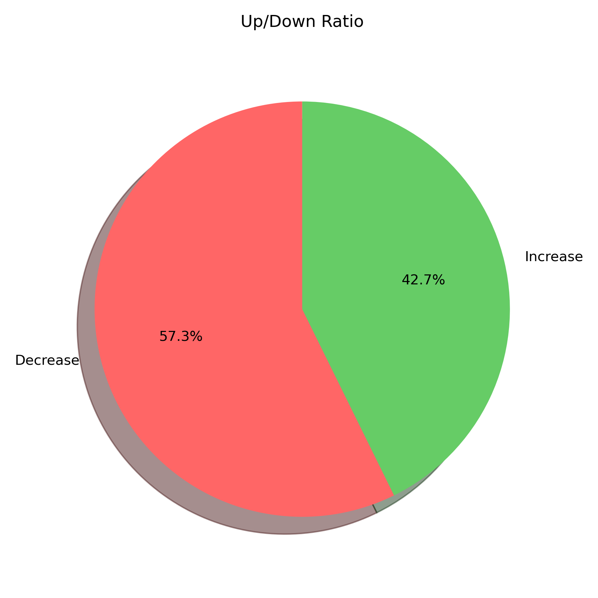
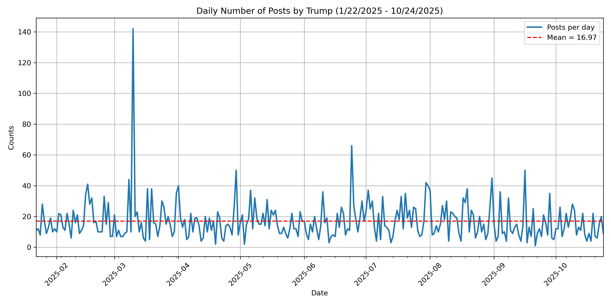
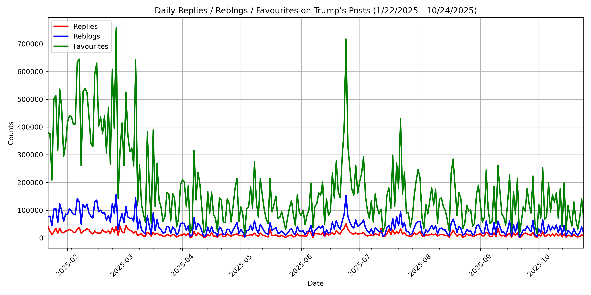
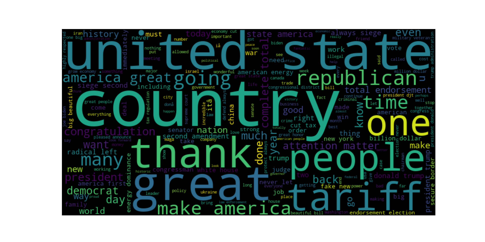
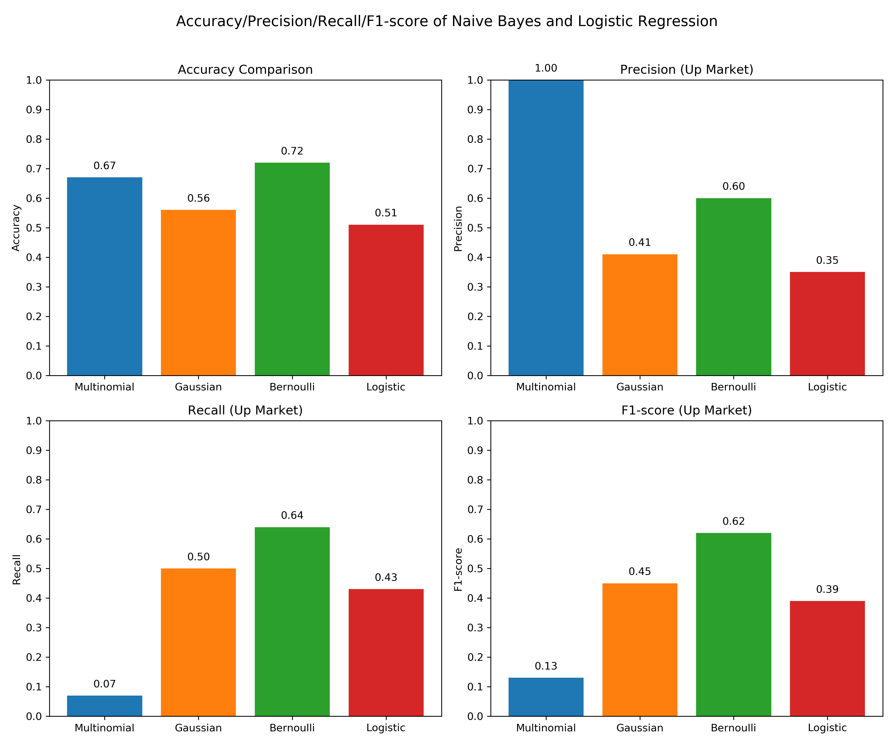

# Truth Social Stock Market Predictor

A text-based machine-learning project that investigates whether Donald Trump's Truth Social posts can help predict the direction of the S&P 500 on the following trading day.

## Overview

The project combines daily Truth Social posts with S&P 500 closing-price data from **January 22 to October 24, 2025**. Posts are cleaned and aggregated by day, converted into TF-IDF text features, and used to classify whether the next trading day's S&P 500 closing price rises or falls.

> This is an exploratory academic project. Its results are not investment advice and should not be used for trading decisions.

## Data

- **Market data:** S&P 500 historical prices from the Wall Street Journal.
- **Social-media data:** [Trump Truth Social Archive](https://github.com/stiles/trump-truth-social-archive).
- **Analysis period:** January 22–October 24, 2025.

## Method

1. Compute next-day closing-to-closing log returns and label each day as **up** (1) or **down** (0).
2. Filter and aggregate Trump's Truth Social posts by day.
3. Clean the post text and represent it with TF-IDF unigrams and bigrams.
4. Train on the first 80% of observations and evaluate on the final 20%, preserving chronological order.
5. Compare Multinomial, Gaussian, and Bernoulli Naive Bayes with Logistic Regression.

## Key result

**Bernoulli Naive Bayes** performs best in this experiment, with **72% test accuracy** and an **F1 score of 0.62** for predicting market upturns. This suggests that the presence of politically salient words may be more informative than their frequency for short-horizon market direction in this sample.

## Visualizations

### Market and posting activity

| S&P 500 closing price | Share of up/down days |
| --- | --- |
|  |  |

| Daily Truth Social posts | Daily engagement |
| --- | --- |
|  |  |

### Text features and model evaluation

| Word cloud | Accuracy, precision, recall, and F1 |
| --- | --- |
|  |  |

| Confusion matrices | ROC curves |
| --- | --- |
|  |  |

## Reproduce the analysis

1. Clone the repository.
2. Install the notebook dependencies:

   ```bash
   pip install pandas numpy matplotlib scikit-learn nltk wordcloud jupyter
   ```

3. Open and run the notebook:

   ```bash
   jupyter notebook code.ipynb
   ```

The notebook expects the project data files, including `truth_archive.csv` and `S&P 500 Stock market data.CSV`, to be available in the working directory.
